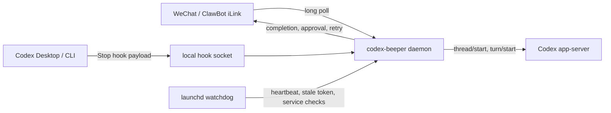

# Codex Beeper

WeChat pager for Codex Desktop/CLI: completion notifications, quote-to-resume, remote approvals, and local watchdog.

**Codex 传呼机**：给 Codex Desktop/CLI 用户用的微信传呼助手。离开电脑后也能收到 Codex 出话、审批请求，并从微信安全续写原 thread。

## Why This Project

很多开源项目已经能把 WeChat、Telegram、Slack 等 IM 接到 Claude Code、Codex、Gemini 或其他 Agent。Codex Beeper（Codex 传呼机）不试图做一个大而全的 Agent OS，它只解决 Codex 用户的离桌工作流：

- **Start on Desktop, finish on WeChat**：Codex Desktop/CLI turn 完成后，通过 Codex Stop hook 推送到微信。
- **Quote to resume safely**：引用完成通知即可续写同一个 Codex thread；引用解析失败会停止，避免跑错项目。
- **Approve from phone**：命令执行、文件写入、apply_patch 和权限提升请求可在微信审批。
- **Local-first and self-healing**：无需公网 webhook；本机 daemon、launchd、watchdog、心跳和 context token stale 检测保障长期运行。



## Competitive Positioning

| Project type | Examples | Focus | Where this project differs |
| --- | --- | --- | --- |
| Multi-agent / multi-IM platforms | `cc-connect`, `Avibe` | Broad platform coverage, many chat apps, many agents. | We stay Codex-native and optimize the Desktop/CLI companion workflow. |
| WeChat generic agent bridges | `WeClaw`, `ClawCenter` | WeChat control for Claude/Codex/Gemini and agent routing. | We emphasize Codex Stop hook notification, quote-to-resume, and local health recovery. |
| Codex command gateways | `CodexBridge` | Broad slash-command surface, automation, uploads, agents. | We keep the user path narrow: notify, read, approve, resume. |
| Notification-only plugins | Claude Code WeChat notification plugins | Completion notification. | We add safe continuation and approval after notification. |

The product bet: Codex power users do not need another large command center first; they need a reliable phone-side companion for the sessions already running on their Mac.

## Quick Start

Prerequisites:

- macOS is recommended for background service and local notifications.
- Node.js 24 or newer.
- `codex` CLI installed and authenticated.
- A WeChat account that can scan the ClawBot/iLink QR code.

```bash
npm install
npm run build
npm link

# 1. Scan QR and save WeChat iLink credentials.
codex-beeper setup

# 2. Bind the owner account. Send the displayed code to ClawBot/iLink in WeChat.
codex-beeper bind-owner

# 3. Configure project roots, runtime posture, Stop hook, service, and watchdog.
codex-beeper configure

# 4. Keep fixing action items until doctor is clean.
codex-beeper doctor
```

`configure` can install and globally trust the `codex-beeper` Stop hook. This is a trust decision for the hook command itself, not for every project.

`wechat-codex` remains as a legacy CLI alias for existing installs.

## Core WeChat Workflow

```text
/projects
/new my-app 帮我看一下这个项目结构
```

When Codex finishes:

```text
my-app项目（a1b2c3）已出话：
已经完成了配置检查和 README 更新。
```

Preferred continuation:

1. In WeChat, quote/reply to the completion notification.
2. Type the next question.
3. The daemon resolves the quoted message back to the exact Codex notice/thread.

Fallback commands:

```text
/show <noticeId|last>
/r <noticeId|threadId|序号> <问题>
/threads [alias]
/resume <noticeId|threadId|序号>
/stop [noticeId|threadId|序号]
```

Plain text without a quote continues the latest Codex completion notice (`last_notice_id`). If WeChat delivery is delayed or messages arrive out of order, quote/reply to the intended completion notification or use `/r <noticeId|threadId|序号> <问题>` to avoid ambiguity.

Send a plain `1` to refresh the WeChat channel/context token without sending anything to Codex. If a WeChat-started task is still running, ordinary text is not queued or sent to Codex; use `/stop` to request an interrupt, or wait for the completion notice.

## Remote Approvals

When Codex asks for a user decision, the daemon forwards implemented approval requests to the owner WeChat account:

```text
Codex 请求微信审批（a1b2c3）
类型：命令执行
命令：npm test
引用本消息回复：同意 / 拒绝
兜底命令：/approve a1b2c3 / /deny a1b2c3
```

Supported approval families:

- command execution
- file write
- apply_patch
- permission escalation

Unsupported interactive server requests, such as MCP elicitation or dynamic tool user input, use protocol-level safe fallbacks instead of pretending the user denied them.

## Project Routing

WeChat users cannot pass arbitrary local paths. They can only select project aliases.

Project sources:

- Auto projects: first-level directories under configured project roots.
- Manual projects: explicitly added by `codex-beeper project add`.

Default root:

```text
~/Documents/My_Projects
```

Commands:

```bash
codex-beeper project-root list
codex-beeper project-root set ~/Code ~/Work
codex-beeper project-root add ~/Documents/My_Projects
codex-beeper project add my-app ~/Code/my-app
codex-beeper project add secret-app ~/Code/secret-app --notify-only
```

`notifyOnly` projects can receive completion notifications but cannot be resumed from WeChat.

## Security Defaults

This project controls local coding agents from a chat app, so the default posture is intentionally conservative.

- `wechatSecurity.ownerOnly=true`: only the owner account can start remote Codex turns, even if other senders are allowlisted.
- Local image sending is on by default for project-scoped images:
  - `wechatSecurity.allowLocalImageSend=true`
  - `wechatSecurity.autoSendLocalImages=true`
- Images must be inside the current project directory or `wechatSecurity.allowedMediaRoots`.
- WeChat runtime is shown during `configure`; keeping `danger-full-access + never` requires explicit confirmation.
- `doctor` warns when full-access remote control, non-owner access, or extra media roots increase risk.

Example explicit media config:

```json
{
  "wechatSecurity": {
    "ownerOnly": true,
    "allowLocalImageSend": true,
    "autoSendLocalImages": true,
    "allowedMediaRoots": ["~/Pictures/codex-share"]
  }
}
```

Runtime commands:

```bash
codex-beeper runtime safe
codex-beeper runtime full-access
codex-beeper runtime status
```

`danger-full-access + never` means the owner WeChat account can remotely trigger full-access Codex turns. Use it only if you accept that risk.

## Reliability Model

The daemon is designed to survive common local and iLink failure modes:

- Inbound WeChat messages are persisted before advancing the iLink sync buffer.
- Inbound messages are claimed with a processing lease; a daemon restart will not immediately replay a message that was already being handled.
- Sender queues serialize normal messages per WeChat sender when idle.
- Approval, keepalive, stop, and busy-check messages can bypass normal sender queues so they can unblock or inspect an active turn.
- Codex turns have a configurable timeout (`codexTurnTimeoutMs`, default 1 hour) and call `turn/interrupt` before restarting the app-server transport.
- Hook payloads are queued if the daemon is down.
- Notices stay undelivered until a valid `context_token` is available.
- A launchd watchdog checks daemon heartbeat, Stop hook readiness, stale context tokens, service status, and undelivered notices.

Background service:

```bash
codex-beeper service install
codex-beeper service status
codex-beeper watchdog status
```

## Codex App-Server Transport

Default transport is `auto`:

- Try shared Desktop app-server proxy:
  ```bash
  codex app-server proxy --sock ~/.codex/app-server-control/app-server-control.sock
  ```
- Fall back to a standalone `codex app-server` when the proxy is unavailable.

Only the shared proxy path can make WeChat-added turns appear live in an already-open Desktop thread. Fallback mode still works, but Desktop may need the conversation reopened.

Check:

```bash
codex-beeper transport status
codex-beeper doctor
```

## Commands

WeChat commands:

```text
/projects
/p <alias>
/p <alias> /new
/new <alias> <问题>
/new
/threads [alias]
/show <noticeId|last>
/resume <noticeId|threadId|序号>
/stop [noticeId|threadId|序号]
/r <noticeId|threadId|序号> <问题>
/approve [审批码]
/deny [审批码]
/approvals
/mute
/unmute
/notify status
```

Local CLI:

```text
setup
bind-owner
configure
doctor
start
project-root list|add|remove|set|enable|disable
project list|add|remove
allow list|add
hook install|trust|uninstall|status
desktop status|restart
transport status
runtime status|safe|full-access
service install|uninstall|status
watchdog install|uninstall|status|run
```

## Troubleshooting

Run:

```bash
codex-beeper doctor
```

Common issues:

| Symptom | Likely cause | Fix |
| --- | --- | --- |
| Desktop finishes but WeChat receives nothing | Desktop started before hook/trust config changed. | `codex-beeper desktop restart` |
| `sendmessage ret=-2` or delivered count does not move | iLink `context_token` is stale. | Send any message from the owner WeChat account to ClawBot/iLink. |
| WeChat continuation works but Desktop does not update live | Shared app-server proxy unavailable. | Reopen the Desktop conversation, or wait for proxy support. |
| `/new` still asks for approval unexpectedly | WeChat runtime differs from global Codex runtime. | `codex-beeper runtime status`, then choose `safe` or `full-access`. |
| Non-owner allowlisted user cannot run commands | `wechatSecurity.ownerOnly=true`. | Keep this for personal installs; disable only if you reviewed every sender. |
| Local image sending is rejected | Sending is disabled in config, or the path is outside the current project / allowed roots. | Enable media config and use project/allowed roots only. |

## Development

```bash
npm run typecheck
npm test
npm run build
npm run schema:check
npm run scan:secrets
```

Release sanity check:

```bash
npm run release:check
```

CI runs `npm run ci` and `npm run scan:secrets`. `schema:check` is local-only because it requires the local `codex` app-server tool.

## Release Checklist

Before publishing to GitHub:

- Confirm `.env`, `~/.codex-wechat`, SQLite files, logs, account credentials, tokens, and local screenshots are not committed.
- Run `npm run release:check`.
- Run `codex-beeper doctor` on a real setup.
- Test `setup`, `bind-owner`, `configure`, `/new`, quote-to-resume, approval, stale-token recovery, and watchdog.
- Confirm the MIT license is the license you want before public release.

See [docs/RELEASE_CHECKLIST.md](docs/RELEASE_CHECKLIST.md) for a more detailed checklist.
